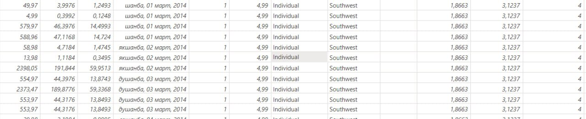
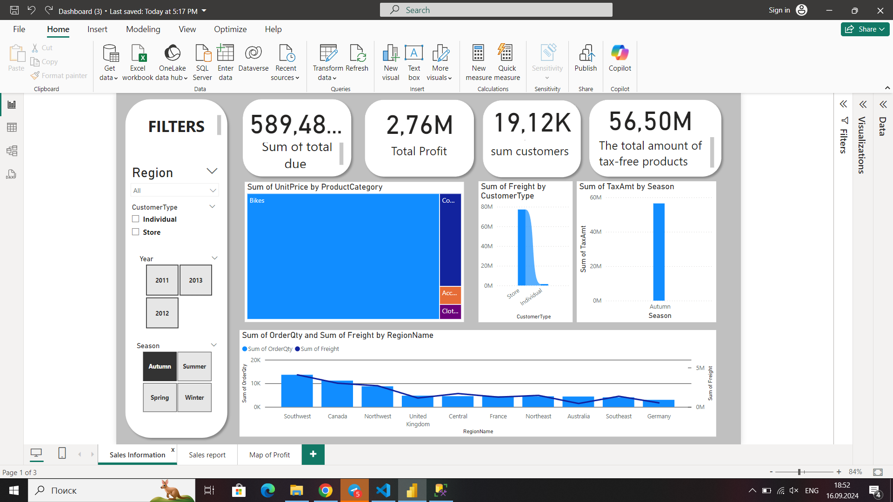
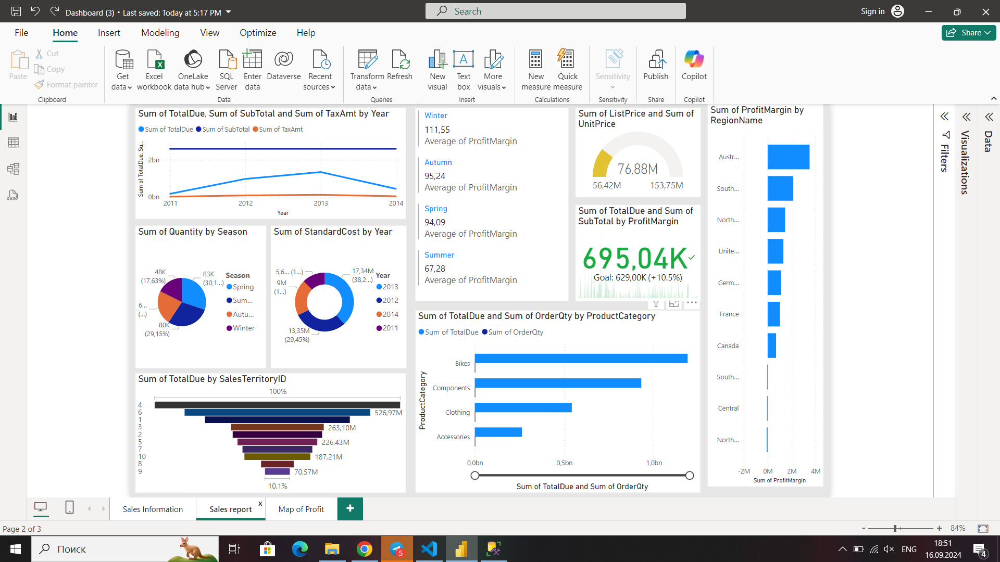
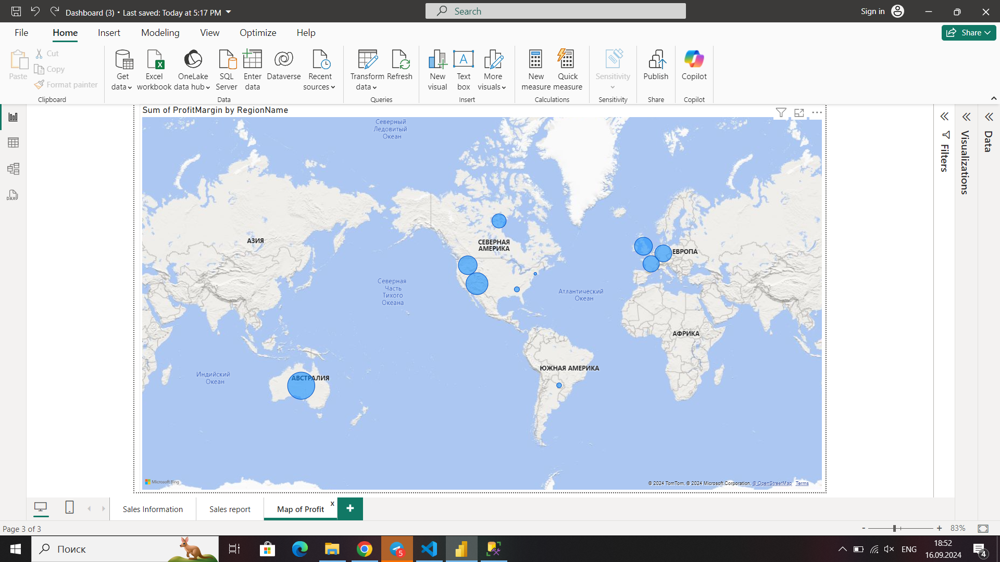

# Power BI Dashboard - Sales Performance Analysis
<video controls src="bandicam 2024-09-17 16-50-42-589.mp4" title="Title"></video>

This repository contains Power BI dashboards that provide insights into sales performance across various dimensions such as region, product category, season, and year. The dashboards visualize key metrics like Total Due, SubTotal, Tax, Profit Margin, and more, allowing users to easily understand and analyze sales data trends.

## Dashboards Overview

### 1. **Sales Information**
This dashboard presents a comprehensive overview of sales data, including:
- **Sum of TotalDue, SubTotal, and TaxAmt by Year**: A line chart showing the yearly trends for total due, subtotal, and tax amounts between 2011 and 2014.
- **Quantity Sold by Season**: A pie chart breaking down the number of units sold during each season (Spring, Summer, Autumn, Winter).
- **StandardCost by Year**: A yearly breakdown of total standard costs for the period between 2011 and 2014.
- **SalesTerritoryID**: A bar chart representing the total sales by different sales territories.
- **List Price and Unit Price**: A gauge visual showing the list price and unit price range.
- **Profit Margin by Season**: A bar chart representing profit margin by season.
  
### 2. **Sales Report**
This dashboard focuses on detailed sales reports and comparisons:
- **Sum of TotalDue and SubTotal by Year**: A line chart showing the growth in total due and subtotal from 2011 to 2014.
- **Total Quantity Sold by Season**: A pie chart illustrating the percentage distribution of sales in each season.
- **Profit Margin by Region**: A bar chart showcasing profit margins across different regions.
- **Sales by Product Category**: A bar chart highlighting total sales and order quantity by product category (Bikes, Components, Clothing, etc.).

### 3. **Margin of Profit**
This dashboard emphasizes the profitability of sales:
- **Profit Margin by Year and Season**: Line and bar charts comparing profit margins over different years and seasons.
- **Profit Margin by Region**: A detailed breakdown of profit margin by sales territories and regions.
- **Profit Margin by Product Category**: Displays how different product categories contribute to overall profitability.

## Key Metrics Tracked
- **Total Due**: The total amount billed for the sales transactions.
- **SubTotal**: The amount before taxes and discounts.
- **Tax Amount (TaxAmt)**: The total tax applicable on the sales.
- **Profit Margin**: The profitability of sales after deducting costs.
- **Quantity Sold**: The number of products sold across various categories and seasons.
- **Freight Costs**: Shipping or transportation costs associated with sales.
  
## Filters & Interactivity
Each dashboard includes interactive filters to allow users to slice and dice the data:
- **Region Filter**: Choose a specific sales region to analyze.
- **Customer Type**: Analyze sales based on customer types (Individual or Store).
- **Year & Season Filter**: Compare sales performance across different years and seasons.

## How to Use the Dashboard
1. **Open the Power BI file**: Load the `.pbix` file in Power BI Desktop.
2. **Interact with the filters**: Adjust the filters (Region, Customer Type, Year, and Season) to explore specific segments of the data.
3. **View insights**: Use the visualizations to identify trends, understand sales performance, and evaluate profitability.

## Data Sources
The dashboards are powered by a dataset containing historical sales data. Key tables include:
- **SalesData**: Contains information about orders, products, customers, and regions.
- **Product Data**: Product category, standard costs, and prices.
- **Region Data**: Geographical regions and territories where sales occurred.

## Insights & Recommendations
- **Seasonal Sales Trends**: Sales are higher in certain seasons, particularly during Spring and Autumn. This can inform inventory and marketing strategies.
- **Regional Performance**: Certain regions, such as Australia and the United Kingdom, contribute significantly to overall profit margins.
- **Product Categories**: Bikes and Components are leading product categories in terms of sales volume and profitability. Companies should focus on expanding offerings and marketing efforts for these products.

## Conclusion
These Power BI dashboards offer a powerful tool for analyzing and optimizing sales performance. By visualizing key metrics, users can make data-driven decisions to improve profitability, reduce costs, and target the right customer segments.

## Future Enhancements
- Add predictive analytics to forecast future sales based on historical trends.
- Include more detailed customer demographic data for advanced segmentation.
- Implement drill-through reports for deeper insights at the transaction level.

---

**Author**: Eshonqulov Haqnazar  
**Date**: 2024  
